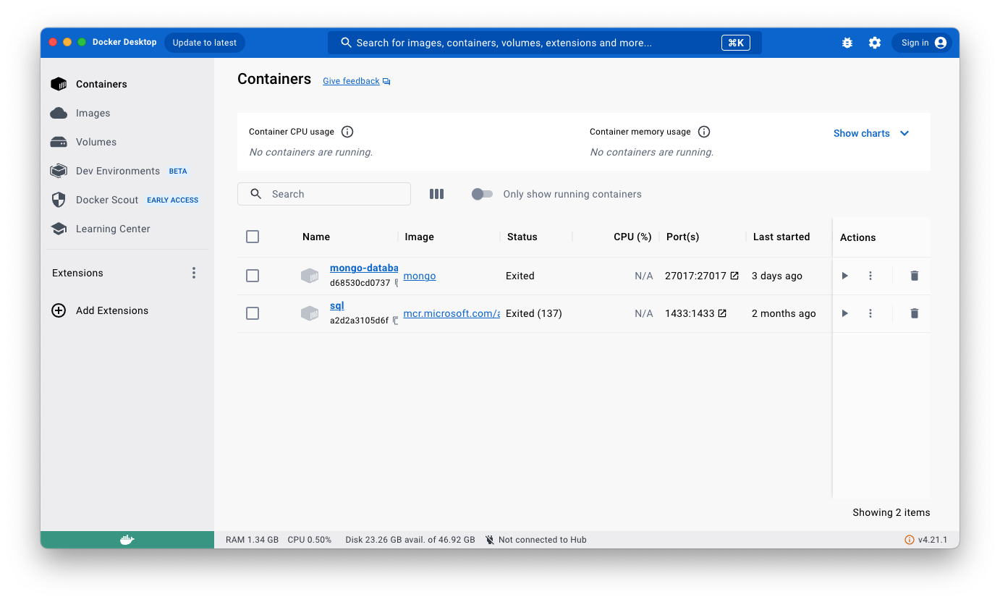

# Documentación

Esta es una sencilla aplicación, en donde se implementa un carrito de compras.

Algunas de las tecnologías que se usan son:

1. Node.js
2. Express
3. Templates .ejs
4. MongoDB

## Instalar librerías

Para instalar la app es solo necesario correr el siguiente comando:

`npm install`

## Instalar MongoDB

Para instalar MongoDB localmente y usar la app necesitamos primero instalar Docker.

### 1. Docker

Seguir la siguiente guía:
<https://docs.docker.com/engine/install/>

### 2. App Docker desktop

También podemos instalar la aplicación de escritorio, para luego poder visualizar de manera sencilla
las imágenes, contenedores, entre otros.

Para descargar la aplicación solo debemos buscar en el navegador "App desktop docker" y dentro del primer
sitio saldrán opciones para cada sistema operativo. También puedes ir al siguiente link:

<https://www.docker.com/products/docker-desktop/>

### 3. MongoDB en Docker

Para instalar MongoDB en docker primero debemos descargar la imagen, luego crear el contenedor y ejecutarlo,
para esto vamos a ejecutar los siguientes comandos en la **terminal**:

Para descargar la imagen de MongoDB ejecutaremos:

`docker pull mongo`

Luego para crear un contenedor con MongoDB y exponer el puerto "27017", ejecutaremos:

`docker run -p 27017:27017 mongo`

Al ejecutar esto creará un contenedor (aparecerá igual en la app de escritorio) y empezará a ejecutarse este
mismo contenedor, para cerrar el proceso solo es necesario usar `Ctrl + c` o `cmd + c`.
Luego podemos ejecutar el contenedor siempre que queramos desde la aplicación de escritorio.

### 4. Instalar MongoDB Compass
